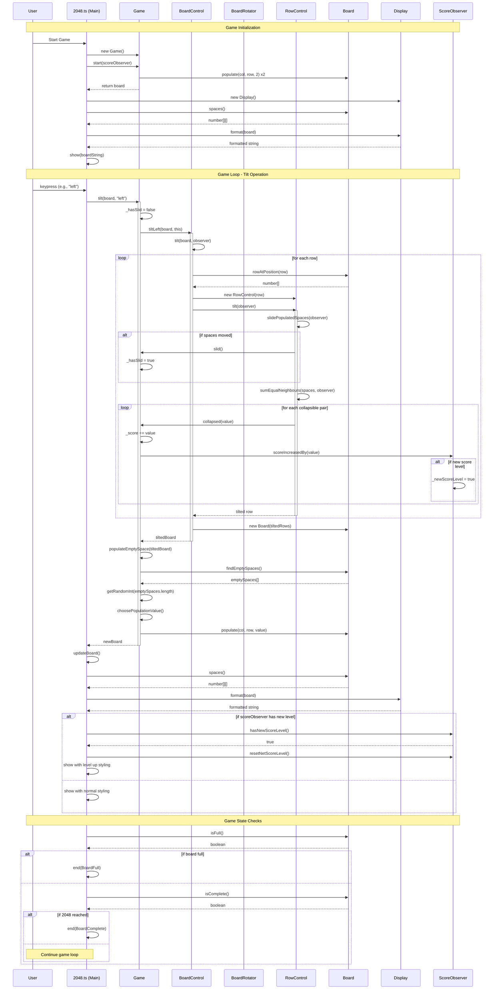

# 2048
CLI Typescript version of 2048 game

## Running

`npm start`


## Testing (including Linting)

```
npm test

> 2048@1.0.0 pretest
> eslint src/**


> 2048@1.0.0 test
> jest --no-cache

 PASS  test/row-control.test.ts
 PASS  test/board-rotator.test.ts
 PASS  test/board-control.test.ts
 PASS  test/board.test.ts
 PASS  test/game.test.ts

Test Suites: 5 passed, 5 total
Tests:       1 skipped, 31 passed, 32 total
Snapshots:   0 total
Time:        1.457 s
Ran all test suites.
```

## Sequence Diagram



## Class Diagram

```mermaid

classDiagram
    %% Core Game Classes
    class Game {
        -_board: Board
        -_score: number
        -_hasSlid: boolean
        -_scoreObserver: ScoreObserver
        +constructor(board?: Board)
        +collapsed(value: number): void
        +slid(): void
        +board(): Board
        +score(): number
        +shuffle(unshuffled: number[]): number[]
        +start(scoreObserver?: ScoreObserver): Board
        +choosePopulationValue(): number
        +tilt(board: Board, direction: string): Board
        -getRandomInt(max: number): number
        -populateEmptySpace(board: Board): Board
    }

    class Board {
        -_board: number[][]
        +constructor(spaces?: number[][])
        +spaces(): number[][]
        +width(): number
        +height(): number
        +isFull(): boolean
        +isComplete(): boolean
        +flatten(): number[]
        +populate(column: number, row: number, value: number): Board
        +toString(): string
        +rowAtPosition(position: number): number[]
        +print(): void
        +findEmptySpaces(): EmptySpace[]
    }

    class Display {
        +pad(value: number): number | string
        +format(board: Board): string
    }

    %% Control Classes
    class BoardControl {
        +tiltLeft(board: Board, observer?: RowTiltObserver)$ Board
        +tiltRight(board: Board, observer?: RowTiltObserver)$ Board
        +tiltDown(board: Board, observer?: RowTiltObserver)$ Board
        +tiltUp(board: Board, observer?: RowTiltObserver)$ Board
        -tilt(board: Board, observer: RowTiltObserver)$ Board
    }

    class BoardRotator {
        +rotate90Degrees(board: Board, rotationCount?: number)$ Board
    }

    class RowControl {
        -_row: number[]
        +constructor(row: number[])
        +slidePopulatedSpaces(observer: RowTiltObserver): number[]
        +tilt(observer?: RowTiltObserver): number[]
        +sumEqualNeighbours(spaces: number[], observer: RowTiltObserver): number[]
        -isSpacePopulated(space: number): boolean
        -areNeighboursEqual(space1: number, space2: number): boolean
    }

    %% Observer Interfaces and Implementations
    class RowTiltObserver {
        <<interface>>
        +collapsed(value: number): void
        +slid(): void
    }

    class NullRowTiltObserver {
        +slid(): void
        +collapsed(value: number): void
    }

    class ScoreObserver {
        <<interface>>
        +scoreIncreasedBy(score: number): void
    }

    class NullScoreObserver {
        +scoreIncreasedBy(score: number): void
    }

    class LevelUpScoreObserver {
        -_scoreLevel: number
        -_newScoreLevel: boolean
        +scoreIncreasedBy(score: number): void
        +hasNewScoreLevel(): boolean
        +resetNetScoreLevel(): void
    }

    %% Enums and Error Classes
    class Direction {
        <<enumeration>>
        Up: "up"
        Down: "down"
        Left: "left" 
        Right: "right"
    }

    class InvalidTiltDirectionError {
        +constructor(message?: string)
        +name: string
    }

    class Error {
        <<built-in>>
        +message: string
        +name: string
        +stack?: string
    }

    class RangeError {
        <<built-in>>
        +message: string
        +name: string
    }

    %% Type Definitions
    class EmptySpace {
        <<type>>
        +row: number
        +column: number
    }

    class KeyPress {
        <<type>>
        +ctrl: boolean
        +name: string
    }

    %% Main Application Components
    class Main2048 {
        <<module>>
        +board: Board
        +game: Game
        +display: Display
        +scoreObserver: LevelUpScoreObserver
        +setup(): void
        +updateBoard(): void
        +gameLoop(): void
        +show(board: string): void
        +end(reason: EndReason): void
    }

    class EndReason {
        <<enumeration>>
        PlayerQuit
        BoardFull
        BoardComplete
    }

    %% Relationships
    Game --> Board : manages
    Game --> ScoreObserver : notifies
    Game ..|> RowTiltObserver : implements
    Game --> BoardControl : delegates to
    Game --> Direction : uses
    Game --> InvalidTiltDirectionError : throws

    BoardControl --> Board : operates on
    BoardControl --> RowTiltObserver : notifies
    BoardControl --> BoardRotator : uses for rotation
    BoardControl --> RowControl : creates

    BoardRotator --> Board : transforms
    BoardRotator --> RangeError : throws

    RowControl --> RowTiltObserver : notifies

    Display --> Board : formats

    Board --> EmptySpace : returns
    Board --> RangeError : throws

    RowTiltObserver <|.. NullRowTiltObserver : implements
    RowTiltObserver <|.. Game : implements

    ScoreObserver <|.. NullScoreObserver : implements  
    ScoreObserver <|.. LevelUpScoreObserver : implements

    InvalidTiltDirectionError --|> Error : extends

    %% Main application relationships
    Main2048 --> Game : creates & uses
    Main2048 --> Display : creates & uses
    Main2048 --> Board : displays
    Main2048 --> LevelUpScoreObserver : creates & uses
    Main2048 --> KeyPress : handles
    Main2048 --> EndReason : uses

    %% Notes about immutability
    note for Board "populate() now returns new Board instance\n(immutable operation)"
    note for Game "Uses immutable Board operations\nfor thread-safe state management"
```


